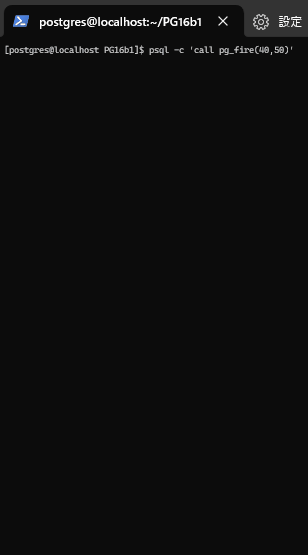

pg_fire
=======

pg_fire is a PostgreSQL extension to show fire effect.

This exension was created by Tatsuro Yamada for [PostgreSQL Advent calendar 2023](https://qiita.com/yamatattsu/items/9c2ed8078dea4c3c9c84).

Contents
========

This README contains the following sections:

1. [Usage](#1-usage)
2. [Installation Requirements](#2-installation-requirements)
3. [Installation](#3-installation)
4. [Author](#4-author)
5. [Acknowledgments](#5-acknowledgments)

1 Usage
=======

Run the following command on psql after Installation.

```
postgres=# call pg_fire(40, 50); -- output size: 40 chars x 50 rows
```

Screen shot:



 
Rotate 90 degrees to the right and it will look like this:


	
2 Installation Requirements
===========================

- Nothing


3 Installation
==============

1. Clone the repository and Install
	```
	su - postgres

	git clone https://github.com/yamatattsu/pg_fire
	cd pg_fire
	make -s install
	```

2. Create extension
	```
	$ psql
	CREATE EXTENSION pg_fire;
	\dx
	```

3. Enjoy watching Fire effect
	```
	call pg_fire(40, 50); -- output size: 40 chars x 50 rows
	```

4 Author
=========

* Tatsuro Yamada (yamatattsu at gmail dot com)

5 Acknowledgments
=================

* [Lode's Computer Graphics Tutorial: Fire Effect](https://lodev.org/cgtutor/fire.html)
